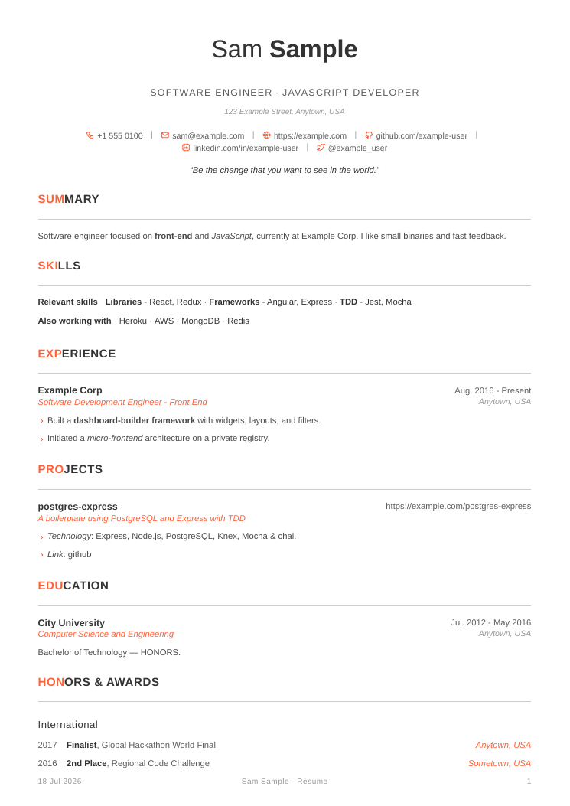
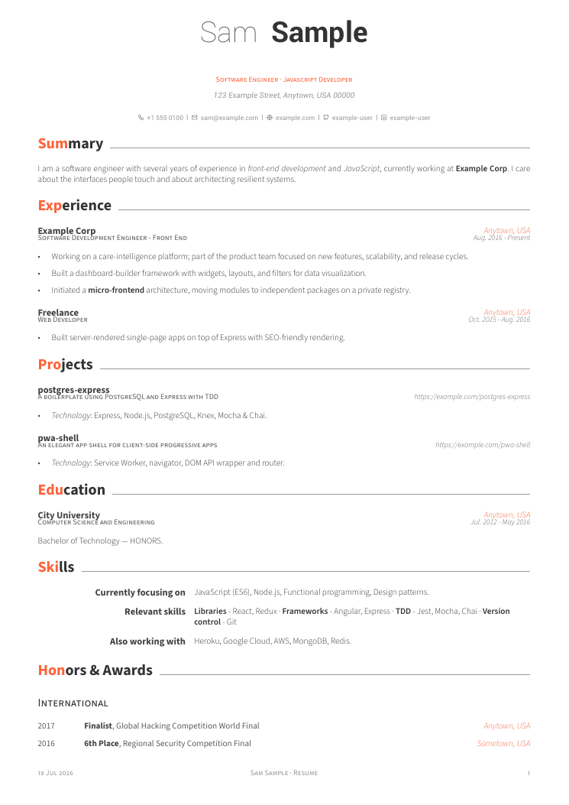
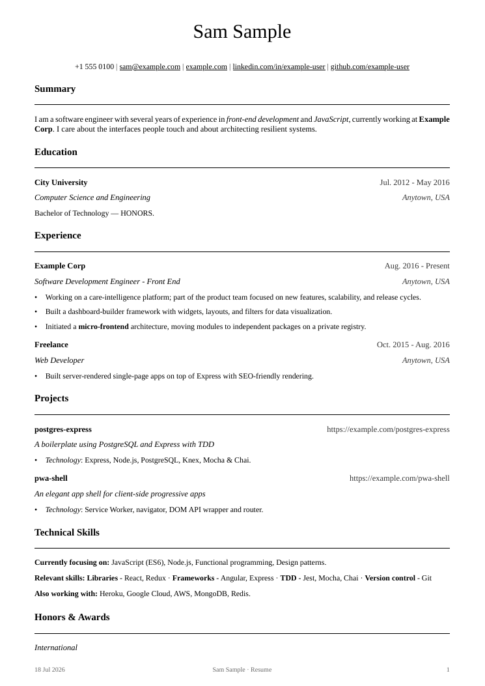
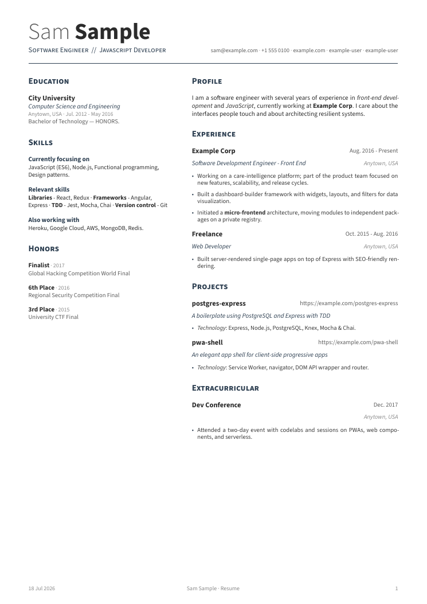
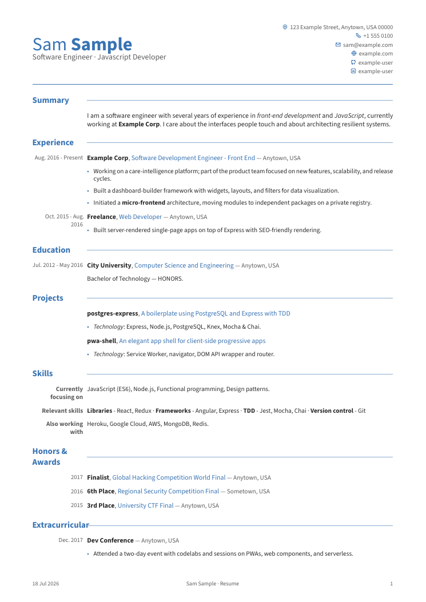
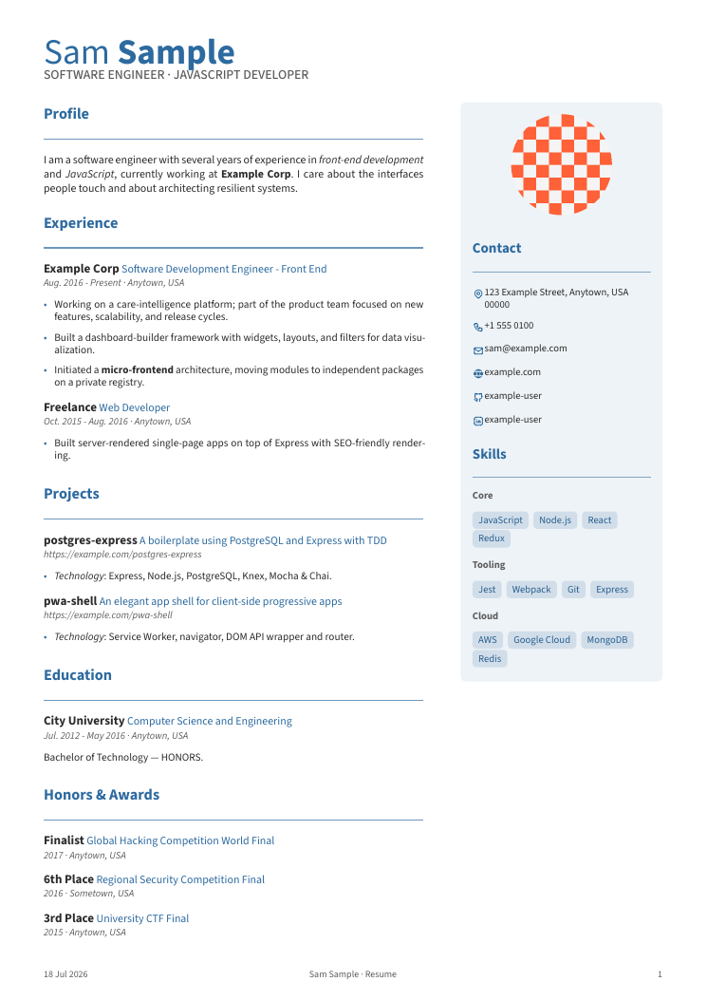

# mkcv

A lightning-fast, zero-dependency CV compiler. Feed it a single YAML file, get
a pixel-perfect, typeset PDF — no LaTeX, no headless browser, no network.

The templates, layout logic, fonts, and icons are all baked directly into a
single statically-linked binary via an embedded [Typst](https://typst.app)
engine, so it runs identically on a fresh OS with no system dependencies.

Several templates ship in the binary, chosen with `meta.template` (and
`meta.kind: cover-letter` for letters):

**Resume**
- **`modern`** (default) — clean, minimalist, Liberation Sans.
- **`crisp`** — polished and professional: Roboto + Source Sans, a two-tone
  name, and small-caps section headers with the first letters in the accent.
- **`serif`** — single-column serif, ATS-friendly and compact.
- **`split`** — two-column: a big two-tone name, narrow-left / wide-right columns.

**CV**
- **`formal`** — classic CV look: colored header, right-aligned contacts,
  left-margin dates.
- **`sidebar`** — two columns with a colored sidebar, photo, and skill tags.

**Cover letter** (`meta.kind: cover-letter`)
- **`modern`** — header-styled letter matching the modern resume.
- **`classic`** — a plain, formal serif business letter.

Every template renders the *same* YAML — switch looks by changing one line. The
same data drives resumes, CVs, and cover letters. Contact/section icons come
from [Tabler Icons](https://tabler.io/icons) (MIT); all fonts (Liberation
Sans/Serif, Roboto, Source Sans 3, Tabler) are embedded, so the binary is
self-contained.

### Gallery

<table>
  <tr>
    <td align="center"><a href="skills/mkcv/previews/modern.png"></a><br><b>modern</b></td>
    <td align="center"><a href="skills/mkcv/previews/crisp.png"></a><br><b>crisp</b></td>
    <td align="center"><a href="skills/mkcv/previews/serif.png"></a><br><b>serif</b></td>
  </tr>
  <tr>
    <td align="center"><a href="skills/mkcv/previews/split.png"></a><br><b>split</b></td>
    <td align="center"><a href="skills/mkcv/previews/formal.png"></a><br><b>formal</b></td>
    <td align="center"><a href="skills/mkcv/previews/sidebar.png"></a><br><b>sidebar</b></td>
  </tr>
</table>

Cover letters: <b>modern</b> ([preview](skills/mkcv/previews/modern-letter.png)) ·
<b>classic</b> ([preview](skills/mkcv/previews/classic-letter.png)). The
`templates` command returns a `preview` URL for each, so an agent can show you a
visual choice.

## Install

`mkcv` is built to be used as an **agent skill**. Install the skill once and
you're done — the skill downloads the `mkcv` binary on first use and drives it.
No toolchain, no manual binary management, nothing else to set up.

```bash
npx skills add satyamyadav/mkcv --skill mkcv
```

Then just ask your agent to *"build my resume"* — the skill bootstraps the
binary, validates your data, and compiles the PDF.

### Other ways to install the skill (no `npx skills`)

The skill is just three files under `skills/mkcv/`. Install it any of these
ways (into your agent's skills directory — `~/.claude/skills/mkcv` for Claude
Code; other agents use their own location):

**a) One-line remote installer** (`curl | sh`) — no clone needed. One script
installs the skill **and** fetches the right binary for your platform:

```bash
curl -fsSL https://raw.githubusercontent.com/satyamyadav/mkcv/main/skills/mkcv/install.sh | sh
```

Installs into `~/.claude/skills/mkcv` (override with `MKCV_SKILL_DIR=…`).

**b) From a clone** — also gives you the binary locally (no download):

```bash
git clone https://github.com/satyamyadav/mkcv
cp -r mkcv/skills/mkcv ~/.claude/skills/mkcv          # or symlink it
export MKCV_REPO="$PWD/mkcv"                          # use the checked-out dist/ binary
```

**c) Copy-paste** — create `~/.claude/skills/mkcv/` and paste the contents of
[`SKILL.md`](skills/mkcv/SKILL.md) and [`install.sh`](skills/mkcv/install.sh).
Or set `MKCV_BIN=/path/to/mkcv` to skip the download entirely.

That single `install.sh` is also the skill's binary resolver: in `--bin` mode it
returns a runnable binary via `MKCV_BIN` → `mkcv` on `PATH` → cache → a repo
clone (`MKCV_REPO`) → download the platform's binary from `dist/`.

### Standalone CLI (optional)

You don't need this for the skill — it fetches the binary itself. But `mkcv` is
a normal CLI you can run directly for CI, scripts, or agent-free use:

```bash
# prebuilt binary (Linux x86_64 today; others: build from source)
curl -fsSL https://raw.githubusercontent.com/satyamyadav/mkcv/main/dist/mkcv -o mkcv && chmod +x mkcv

# or from source
git clone https://github.com/satyamyadav/mkcv && cd mkcv && cargo install --path .
```

Add `--features fallback-fonts` for CJK/emoji/math coverage (~7 MB). The binary
is ~40 MB (embedded Typst engine). Multi-platform binaries and an `npx` wrapper
are planned for v2.

## Usage

```bash
mkcv init                                   # scaffold a resume.yml
mkcv build --input resume.yml --output resume.pdf
mkcv build --template crisp            # override meta.template
mkcv build --yaml "$(cat resume.yml)"       # inline YAML instead of a file
mkcv watch --input resume.yml               # rebuild on save
mkcv templates                              # list templates
mkcv schema                                 # describe the YAML schema
mkcv validate --input resume.yml            # parse-check without building
```

`--input`/`--output` default to `resume.yml` and `resume.pdf`, so a bare
`mkcv build` works once you've run `init`.

### Structured output (for agents/scripts)

Every command accepts `--format json`, emitting one structured object and
exiting non-zero with a JSON error on failure — so `mkcv` can be driven by
tools that parse stdout:

```bash
$ mkcv build --format json
{"ok":true,"output":"resume.pdf","pages":1,"ms":9.5}
$ mkcv validate --yaml 'profile: {}' --format json
{"ok":false,"errors":["profile is missing a name: …"]}
```

### Custom templates

The fastest way to customize is to **eject** a built-in template and edit it,
rather than starting from a blank file:

```sh
mkcv eject crisp --output my-layout.typ   # copy the "crisp" source to edit
mkcv eject modern --kind cover-letter -o my-letter.typ
```

Then point `meta.template` at your local `.typ` file (relative to the YAML):

```yaml
meta:
  template: "./my-layout.typ"
```

An ejected file is self-contained (the shared prelude is inlined when the
template needs it) and ready to compile as-is; tweak from there.

A custom template receives the parsed resume as `data` plus the shared
`_core.typ` helpers already in scope: `has`, `orelse`, `firstof`, `accent`,
`resolve-color`, `paper`, `footer-part`, and `ti-glyphs` (Tabler contact
codepoints; the full Tabler font is embedded, so any icon is usable). It must
define its own `#set page`/`#set text`. It is a single file — external
`#import`/`read` is not available (the compiler is sandboxed to your data + the
profile photo).

## Data schema

Only `profile.name` is required. Every other field is optional and the layout
adapts — omitted sections simply don't render.

```yaml
meta:
  template: "crisp"      # modern (default), crisp, serif, split, formal, sidebar
  color: "orange"     # named preset OR a "#hex" (accent_color still works)
  section_highlight: "full"   # "full" | "three-letter" | "none"
  paper: "a4"                 # "a4" | "letter"

profile:
  name: "Your Name"           # OR first_name + last_name (last is bolded)
  positions: ["Systems Engineer", "Rustacean"]  # OR a single `title`
  address: "Anytown, USA"
  email: "you@example.com"
  phone: "+1 555 0100"        # `mobile` accepted as an alias
  location: "Remote"
  website: "https://example.com"  # `homepage` accepted as an alias
  github: "example-user"
  linkedin: "example-user"
  twitter: "example_user"
  quote: "An optional italic quote under the header."
  photo: { path: "me.jpg", shape: "circle", side: "right", edge: true }  # optional

# Optional three-part footer. {today} and {page} are substituted.
footer: { left: "{today}", center: "Your Name - Resume", right: "{page}" }

# Optional explicit section order (omit to use the default).
order: [summary, skills, experience, projects, education]

summary: "One-paragraph pitch."

experience:
  - company: "Core Tech Ltd"
    role: "Backend Engineer"
    location: "Remote"
    period: "2024 - Present"
    bullets:
      - "Impact-oriented achievement with a number."

projects:
  - name: "mkcv"
    description: "Short tagline"
    link: "https://github.com/example-user/mkcv"
    bullets: ["What it does."]

education:
  - institution: "State University"
    degree: "B.Sc. Computer Science"
    location: "Boston, MA"
    period: "2018 - 2022"
    details: "Optional extra line."

skills:
  - category: "Languages"
    items: ["Rust", "Go", "TypeScript"]   # discrete list
  - category: "Relevant skills"
    text: "**Frameworks** - React, Express · **TDD** - Jest, Mocha"  # free-form (markup)

honors:
  - subsection: "International"            # optional grouping heading
    items:
      - { award: "Finalist", event: "Global Hackathon", location: "Anytown, USA", date: "2017" }

extracurricular:
  - heading: "Dev Community Meetup"
    location: "Anytown, USA"
    date: "Dec. 2017"
    bullets: ["Organized workshops on web components and PWAs."]
```

Run `mkcv init` to drop a complete, working example into your directory.

### Color presets

`meta.color` accepts a `#hex` or one of the built-in presets: `emerald`,
`skyblue`, `red`, `pink`, `orange`, `nephritis`, `concrete`, `darknight`.

### Section highlighting

`meta.section_highlight` controls how section titles are accented: `full`
(whole title, default), `three-letter` (only the first three letters), or
`none`.

### Inline markup

Free-text fields — `summary`, `quote`, entry `bullets`, `description`,
`details`, and skill `items`/`text` — support a small, safe subset:

- `**bold**` → **bold**
- `*italic*` → *italic*
- `[label](https://url)` → a link

Everything else is escaped, so resume content can never inject Typst code.

### Cover letters

Set `meta.kind: cover-letter` and add a `letter:` block; the same binary and
header render it. `{today}` is substituted in `date`.

```yaml
meta:
  kind: cover-letter
letter:
  recipient_name: "Hiring Team"
  recipient_address: "Example Inc.\n1 Example Plaza\nAnytown, USA"
  date: "{today}"
  title: "Application for Senior Engineer"
  opening: "Dear Hiring Manager,"
  sections:                        # OR a flat `body: [...]`
    - title: "About Me"
      body: ["Paragraph one, with **markup**.", "Paragraph two."]
  closing: "Sincerely,"
  enclosure: "Resume"
  enclosure_label: "Attached"
```

### Photo

`profile.photo.path` is resolved relative to the input file and embedded into
the PDF. `shape` is `circle` (default) or `rect`, `side` is `right` (default) or
`left`, and `edge` draws a thin accent border.

## Architecture

```
resume.yml ──▶ serde parser ──▶ template inserter ──▶ Typst engine ──▶ resume.pdf
                (parser.rs)      (template.rs)          (engine.rs)
```

- **`parser.rs`** — strongly-typed serde schema for the YAML.
- **`template.rs`** — serialises the resume into a native Typst dictionary and
  prepends it to the embedded `.typ` layout.
- **`engine.rs`** — a minimal in-memory Typst `World` over the embedded fonts,
  compiling straight to PDF bytes.
- **`watcher.rs`** — filesystem listener for the `watch` loop.
- **`assets/`** — embedded fonts (`include_bytes!`) including `tabler-icons.ttf`,
  and `.typ` templates (`include_str!`).

### Icons

Icons are drawn from the embedded Tabler Icons font (family `tabler-icons`).
The template maps names to glyph codepoints at the top of
[`modern.typ`](assets/templates/modern.typ):

```typst
#let glyphs = (
  mail: "\u{eae5}",     // ti-mail
  github: "\u{ec1c}",   // ti-brand-github
  // ...
)
#let icon(name, ..) = text(font: "tabler-icons", ..)[#glyphs.at(name)]
```

The codepoints are pinned to the exact bundled font version (Tabler 3.45.0), so
the mapping never drifts from the glyphs. To use a different icon, look up its
`ti-<name>` codepoint in Tabler's CSS and add an entry.

## Adding a template

Drop a new `.typ` file in `assets/templates/`, `include_str!` it in
`template.rs`, and add a match arm keyed on `meta.template`. Templates receive
the resume as a Typst dictionary named `data`.
